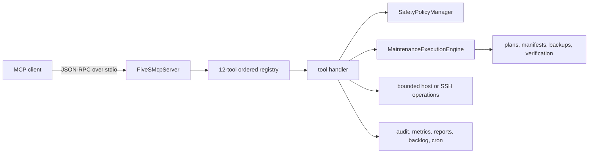
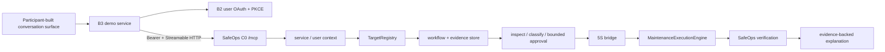

# Architecture

One MCP process owns stdio transport, ordered tool registration, request dispatch, and error conversion. The registry supplies source-backed annotations and documentation metadata; each tool handler owns its action-level validation, policy calls, process execution, and state writes.

## Ownership boundaries

| Surface | Owner |
|---|---|
| Transport, list-tools, call-tools, MCP error envelope | `src/mcp-server/server.js` |
| Ordered names, groups, annotations, lifecycle summaries | `src/mcp-server/tool-registry.js` |
| Input JSON Schemas and action behavior | individual factories in `src/mcp-server/tools/` |
| Local cleanup plan/stage/apply and verification | `src/maintenance-engine.js` |
| Deny/allow rules and operation verdicts | `src/safety-policy.js` plus `config/safety-policy.json` |
| Platform capability normalization | `src/platform-capabilities.js` |
| Procedure records and optional MongoDB sync | `src/changelog/` |

There is no single cross-tool runtime policy wrapper. Policy enforcement is action-specific and must remain explicit in every tool that accepts paths, cleanup, configuration mutation, or remote evidence. MCP annotations are exposed by list-tools, but callers must still read the exact action contract.

## State boundaries

Defaults include `config/safety-policy.json`, `/tmp/5s-plans`, `/backup/5s`, `/tmp/5s-kaizen-backlog.json`, `/tmp/5s-audit.log`, `/tmp/5s-metrics.json`, and `/tmp/5s-reports`. Environment variables can redirect supported state roots. State paths are operator data: protect permissions, retention, and backups outside the MCP protocol.

## Extension boundary

A normal finite read-only tool can use the existing registry/factory pattern. A new destructive action, persistent process, credential form, remote transport, policy relaxation, state format, package entrypoint, or trust boundary requires architecture and security review before documentation claims are updated.

## SafeOps hackathon increment

The Alexa+ hackathon increment is physically separate from the inherited stdio registry. `src/safeops/server.js` exposes exactly three workflow tools and never imports the legacy 12-tool registry. `src/safeops/http.js` provides the Streamable HTTP carrier; validated HTTP auth becomes SDK `AuthInfo`, then service and optional actor context. `TargetRegistry` binds the actor to an operator-configured workspace before planning.

The participant surface is a carrier, not an authority root. The backend owns classification, approval receipt, executable-set enforcement, effect evidence, verification, and explanation.

The inherited engine supports optional bounded target profiles and exact operation subsets. With no target profile or operation subset, legacy behavior remains available to the inherited stdio surface. SafeOps always supplies both boundaries for effectful use. `ExecutableSet <= Approved SAFE Set`; REVIEW and DENIED actions cannot enter ordinary SafeOps approval.

For the controlled hackathon target, [`scripts/safeops-c0-start.mjs`](../scripts/safeops-c0-start.mjs) validates the exact target/policy contract and materializes the deterministic SAFE / REVIEW / DENIED fixture before starting the backend.

The live hackathon proof exercised user OAuth, MCP initialize/list, inspect, bounded SAFE-only apply, post-effect verification, and explanation. That proof is intentionally narrower than production readiness: it does not claim Amazon-hosted Alexa+ UI access, unrestricted authority, customer production deployment, or mainline adoption.
