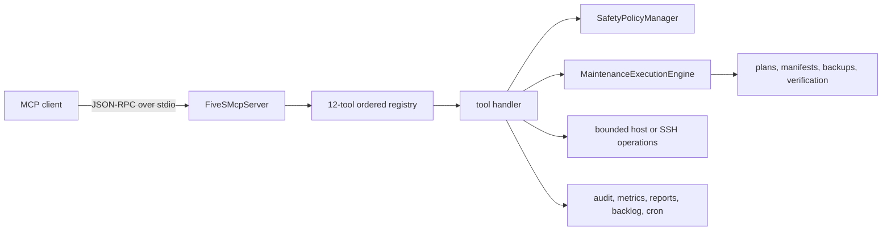

# Architecture

One MCP process owns stdio transport, ordered tool registration, request dispatch, and error conversion. The registry supplies source-backed annotations and documentation metadata; each tool handler owns its action-level validation, policy calls, process execution, and state writes.

## Ownership boundaries

| Surface | Owner |
|---|---|
| Transport, list-tools, call-tools, MCP error envelope | `src/mcp-server/server.js` |
| Ordered names, groups, annotations, lifecycle summaries | `src/mcp-server/tool-registry.js` |
| Input JSON Schemas and action behavior | individual factories in `src/mcp-server/tools/` |
| Local cleanup plan/stage/apply and verification | `src/maintenance-engine.js` |
| Deny/allow rules and operation verdicts | `src/safety-policy.js` plus `config/safety-policy.json` |
| Platform capability normalization | `src/platform-capabilities.js` |
| Procedure records and optional MongoDB sync | `src/changelog/` |

There is no single cross-tool runtime policy wrapper. Policy enforcement is action-specific and must remain explicit in every tool that accepts paths, cleanup, configuration mutation, or remote evidence. MCP annotations are exposed by list-tools, but callers must still read the exact action contract.

## State boundaries

Defaults include `config/safety-policy.json`, `/tmp/5s-plans`, `/backup/5s`, `/tmp/5s-kaizen-backlog.json`, `/tmp/5s-audit.log`, `/tmp/5s-metrics.json`, and `/tmp/5s-reports`. Environment variables can redirect supported state roots. State paths are operator data: protect permissions, retention, and backups outside the MCP protocol.

## Extension boundary

A normal finite read-only tool can use the existing registry/factory pattern. A new destructive action, persistent process, credential form, remote transport, policy relaxation, state format, package entrypoint, or trust boundary requires architecture and security review before documentation claims are updated.
